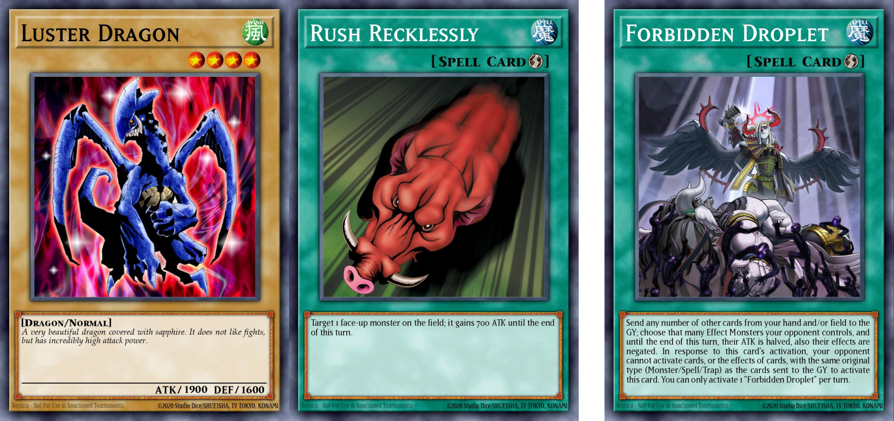
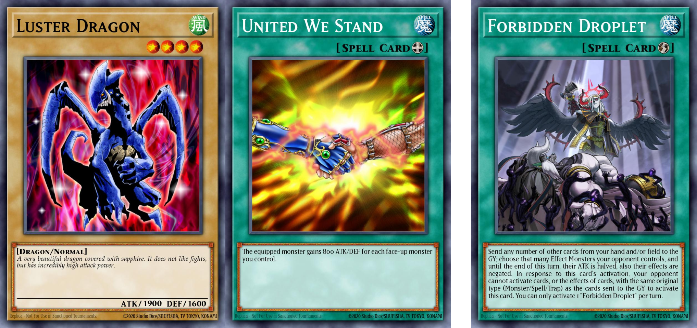
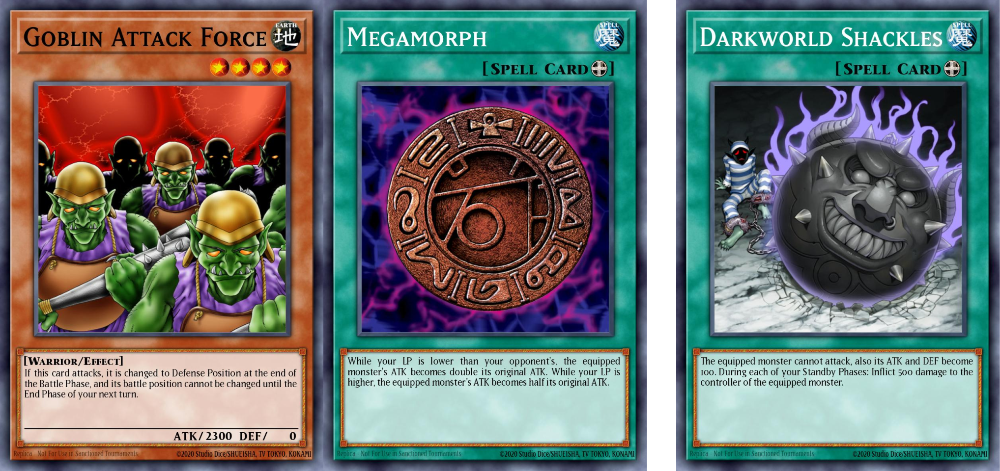

<!-- TOC -->

- [Getting started](#getting-started)
    - [Things you need to duel](#things-you-need-to-duel)
    - [The Game Mat/Field](#the-game-matfield)
- [Game mechanics](#game-mechanics)
    - [Turns](#turns)
        - [Damage Step](#damage-step)
            - [Sub-steps of the Damage Step](#sub-steps-of-the-damage-step)
            - [Cards/effects that can be activated during the Damage Step](#cardseffects-that-can-be-activated-during-the-damage-step)
- [Card text](#card-text)
    - [Problem Solving Card Text PSCT](#problem-solving-card-text-psct)
    - [Summoning](#summoning)
        - [Summon restrictions and successful summons](#summon-restrictions-and-successful-summons)
    - [Effects](#effects)
        - [Retaining information](#retaining-information)
        - [Stats ATK/DEF modifiers](#stats-atkdef-modifiers)
            - [Categories and interactions](#categories-and-interactions)
            - [Special cases](#special-cases)
        - [Trigger effects](#trigger-effects)
            - [Leaves the field](#leaves-the-field)
            - [Location changes mid-chain](#location-changes-mid-chain)
        - [Specific effects](#specific-effects)
            - [Prohibition](#prohibition)
            - [Rivalry of the Warlords](#rivalry-of-the-warlords)

<!-- /TOC -->

(<a href="#readme-top">back to top</a>)

# Getting started
[Official rulebook](https://www.yugioh-card.com/en/rulebook/)

## Things you need to duel

- **Main Deck**
	- The (Main) Deck must be 40 to 60 cards
	- You can only have up to 3 copies of the same card in your Deck, Extra Deck and Side Deck combined.

- **Extra Deck**\
This Deck consists of Xyz Monsters, Synchro Monsters, Fusion Monsters and Link Monster which can be used during the game if you meet certain requirements
	- You can have up to 15 cards in the Extra Deck
	- The Extra Deck can contain Xyz Monsters, Synchro Monsters, Fusion Monsters and Link Monsters in any combination
	- These cards are not counted towards the 40-card minimum limit your Main Deck.

- **Side Deck**\
This is a separate Deck of cards you can use to change your Deck during a Match. After each Duel in a Match, you can swap any card from your Side Deck with a card from your Deck and/or Extra Deck to customize your strategy against your opponent
	- The number of cards in your Side Decks must not exceed 15
	- The number of cards in your Side Deck before and after you swap any cards must be exactly the same

(<a href="#readme-top">back to top</a>)

## The Game Mat/Field
The Game Mat helps you organize your cards during a Duel. When you use your cards you place them on the Game Mat. Different kinds of cards are placed in different Zones.

	

**1. Main Monster Zone**\
This is where you put your monsters when they’re played. You can have up to 5 cards here. There are 3 ways to position your Monster Cards: face-up Attack Position, face-up Defense Position, and face-down Defense Position. Place the card upright for Attack Position, and sideways for Defense Position.

**2. Spell & Trap Zone Pendulum Zone**\
This is where you put Spell & Trap Cards. You can have up to 5 cards here. You place them here face-up to activate them, or place them face-down. Pendulum Monster Cards can be activated in the leftmost and rightmost zones as Spells. This causes the zone you use to also become a Pendulum Zone for as long as the Pendulum Monster Card is there.

**3. Graveyard (GY)**
When Monster Cards are destroyed, and when Spell & Trap Cards are used, they’re sent face-up to this space. The contents of both players’ Graveyards are public knowledge, and your opponent can look through yours at any time during the Duel. The order of the cards in the Graveyard should not be changed. Graveyard is shortened in the card text to "GY".

**4. Deck**\
Your Deck is placed face-down in this space. You draw cards from here to add to your hand. If a card effect requires you to reveal cards from your Deck, or look through it, shuffle it and put it back in this space afterwards.

**5. Field Zone**\
Special Spell Cards called Field Spell Cards are played here. Each player can have 1 Field Spell Card on their own side of the field. To use another Field Spell, send your previous one to the Graveyard. Field Spell Cards do not count towards the 5-card limit of your Spell & Trap Zone.

**6. Extra Deck**\
Place your Extra Deck face-down in this space. You can look at the cards in your own Extra Deck during the game. During a Duel, Extra Deck Monsters may be Summoned to the field from here using special methods. Pendulum Monster Cards that would be sent from the field to the Graveyard are placed face-up here.

 **7. Extra Monster Zone**\
This is where you put your monsters that are Summoned to the field by special methods from the Extra Deck

- Normally, each player can only use 1 of these zones. A monster placed in this zone does not count towards the 5-monster limit of your Main Monster 
Zone.

- Fusion, Synchro, and Xyz Monsters can be first Summoned from the Extra Deck to any of your Main Monster Zones. They do not have to be Summoned to the Extra Monster Zone or a spot that a Link Monster is pointing to. You can still Summon a Fusion/Synchro/Xyz Monster from the Extra Deck to your Extra Monster Zone if you want to, though.

- The restrictions requiring an Extra Monster Zone or Link Monster pointing still apply to Link Monsters and Pendulum Monsters that are Summoned from the Extra Deck.

(<a href="#readme-top">back to top</a>)

# Game cards

## Monster cards

	

**1. Card Name**\
This is the card's name. When a card name is mentioned in card text it appears in quotations. If cards have the same name, they are considered to be the same card.

**2. Level**\
Count the number of stars here to find out the monster's Level. For Xyz Monsters, the number of stars is the Rank of the monster, and is on left.

**3. Attribute**\
Every monster has an Attribute. This Attribute is sometimes important for card effects.

	

(<a href="#readme-top">back to top</a>)

# Game mechanics

## Turns

### Damage Step
[Source](https://www.yugioh-card.com/eu/play/damage-step-rules/),
[Yugipedia](https://yugipedia.com/wiki/Damage_Step)

#### Sub-steps of the Damage Step
There are five distinct timings within the Damage Step.
1. Start of the Damage Step

2. Before damage calculation

3. Damage calculation

4. After damage calculation

5. End of the Damage Step

<table>
	<tr>
		<th>Sequence</th>
		<th>What happens</th>
		<th>What can/cannot activate</th>
		<th>What can/cannot apply</th>
	</tr>
	<tr>
		<th>Start of the Damage Step</th>
		<td><ul>
			<li>You declare that you are entering the Damage Step</li>
			<li>Face-down monsters are not flipped</li>
		<ul></td>
		<td>
			✔️ "at the start of the Damage Step"
			  
			✔️ Spell/Trap Cards and Quick/Quick-like Effects that directly alter the ATK/DEF
		</td>
		<td>
			✔️ "during the Damage Step (only)"
		</td>
	</tr>
	<tr>
		<th>Before damage calculation</th>
		<td><ul>
			<li>If the monster being attacked is face-down, flip it face-up</li>
		<ul></td>
		<td>
			✔️ "before damage calculation"
			  
			✔️ Spell/Trap Cards and Quick/Quick-like Effects that directly alter the ATK/DEF
			  
			❌ Effects that activate when a monsters is flipped face-up: won't activate as well after damage calculation if the flipped monster itself leaves the Monster Zone before then ("Drillroid" will destroy without triggering Flip effects)
		</td>
		<td>
			✔️ If a monster is flipped face-up and it has a Continuous Effect, then typically that Continuous Effect is applied immediately, such as the effects of monsters like "Star Boy" and "Jinzo"
			  
			❌ Continuous Effect that would prevent the flipped monster from being targeted for attacks, attacked or would prevent the attacking monster from attacking: the monster has already been targeted as an attack target
			  
			❌ Continuous Effect that destroys itself under certain conditions that are currently met (such as "Giant Kozaky", "Zombie Mammoth", etc.), the monster is not destroyed yet and the Damage Step proceeds normally, until after damage calculation. The same applies if "Rivalry of Warlords" or "Gozen Match", or if there is an active 'Unclassified Effect' (belonging either to the flipped monster or another face-up monster) that states "You can only control 1 [...]" or "There can only be 1 [...] on the field"; the appropriate actions are determined and performed after damage calculation
		</td>
	</tr>
	<tr>
		<th>Perform damage calculation</th>
		<td><ul>
			<li>Compare ATK/DEF and apply damage to Life Points</li>
			<li>Determine whether either monster will be destroyed by battle or not, but do not send it to the GY yet If there is a Continuous/Continuous-like Effect or Unclassified Effect that has the player perform a certain action instead of the monster being destroyed by this battle (such as that of "Return of the Dragon Lords" banishing itself from the GY instead of destroying the monster), the relevant player must choose (at this point) whether or not they will use it. If they do, that action is not performed right at that time; instead, it will be applied immediately after damage calculation ("Return of the Dragon Lords" would be banished after damage calculation)</li>
		<ul></td>
		<td>
			✔️ "during damage calculation"
			  
			❌ Effects that activate when a monsters is flipped face-up: won't activate after damage calculation if the flipped monster itself leaves the Monster Zone before then ("Drillroid" will destroy without triggering FLIP effects)
		</td>
		<td>
			✔️ "during damage calculation (only)"
		</td>
	</tr>
	<tr>
		<th>After damage calculation</th>
		<td><ul>
			<li>
				Monsters that have been considered to be destroyed by battle are still not sent to the GY yet. Even though the monsters are still on the field:
				<ul>
					<li>They cannot be targeted by cards or effects, have their battle positions changed, or have their ATK/DEF changed</li>
					<li>Their Continuous Effects are no longer applied</li>
					<li>Their optional Quick Effects can no longer be activated</li>
					<li>They cannot be returned to the hand by card effects, unless a card effect specifies that it can return destroyed monsters (such as "Last Minute Cancel"), but even then the destroyed monster will not be returned yet</li>
					<li>Their effects can still be negated</li>
					<li>Before those monsters would be sent to the GY (or another appropriate location) as a result of being destroyed by battle, it is possible for them to be destroyed by card effects, sent to the GY by card effects, or banished by card effects before that can occur</li>
					<li>If a monster ends up leaving the field before it can be sent to the GY (or another appropriate location) as a result of battle, cards and effects that would activate when/if that monster is destroyed by battle and sent to the GY cannot be activated ("Gozen Match")</li>
					<li>They cannot be used as a cost to activate a card or an optional effect. But they can be used as a cost to activate a mandatory effect, such as "Doomcaliber Knight"</li>
				</ul>
			</li>
		<ul></td>
		<td>
			✔️ "after damage calculation"
			  
			✔️ "this card battles" or "attacks or is attacked"
			  
			✔️ If a player takes battle damage such as "Don Zaloog"
			  
			✔️ If a monster is flipped face-up (including Flip effects) 
		</td>
		<td>
			✔️ If a monster with a Continuous Effect that destroys itself under certain conditions ("Giant Kozaky", "Zombie Mammoth", etc.) survives damage calculation without being determined to be "destroyed by battle", that Continuous Effect will immediately apply at this point and destroy that monster if those conditions are still met
			  
			✔️ If a monster was flipped face-up during the Damage Step and "Rivalry of Warlords"/"Gozen Match" is still active, if that monster has a Attribute/Type that conflicts with another monster already face-up on the field, the flipped monster will immediately be sent to the Graveyard at this point
			  
			✔️ If a monster was flipped face-up during the Damage Step and its name conflicts with another monster that is already face-up on the field, as defined by an 'Unclassified Effect' that states "You can only control 1 [...]" or "There can only be 1 [...] on the field" (belonging either to the flipped monster or another face-up monster), the flipped monster will be immediately destroyed
		</td>
	</tr>
	<tr>
		<th>End of the Damage Step</th>
		<td><ul>
			<li>Monsters that were determined to be destroyed by battle are now normally sent to the GY, unless they are Pendulum Monsters or if a card effect states otherwise</li>
			<li>Once there are no effects left to activate or resolve, the Damage Step ends, and the Battle Step is automatically re-entered. At the time both players agree to enter the Battle Step, effects that apply "until the end of the Damage Step" now expire and no longer apply</li>
		<ul></td>
		<td>
			✔️ "at the end of the Damage Step"
			  
			✔️ When/if a monster is destroyed by battle
			  
			✔️ When/if a monster destroys another monster by battle
			  
		</td>
		<td>
		</td>
	</tr>
</table>

(<a href="#readme-top">back to top</a>)

#### Cards/effects that can be activated during the Damage Step

✔️ Counter Trap Cards

✔️ Mandatory effects

✔️ Fast effects that negate the **activation** of a card(s), or negate the **activation** of an effect(s)

✔️ Spell/Trap Cards and Quick/Quick-like Effects that directly alter the ATK/DEF of a monster(s), but only up until damage calculation. During damage calculation or afterwards in the Damage Step, they cannot be activated
	
$\hspace{2em}$✔️ These cards and effects do not have to affect a battling monster; they can be used during the Damage Step to affect the ATK/DEF of a monster(s) that is not currently battling

$\hspace{2em}$❌ Optional Spell/Trap Cards and Quick/Quick-like Effects that can **indirectly** change the ATK/DEF of a monster (such as "Reverse Trap" or "Skill Drain") **cannot** be activated during the Damage Step for that reason alone

$\hspace{2em}$✔️ Trap Cards that equip themselves to monsters and have Continuous-like Effects that **directly** alter the ATK/DEF of the equipped monster, such as "Horn of the Phantom Beast", **can** be activated during the Damage Step for that reason alone

$\hspace{2em}$❌ Cards like "Half or Nothing", which **might not** alter ATK/DEF at resolution, **cannot** be activated during the Damage Step for that reason alone

$\hspace{2em}$❌ Cards such as "Powerful Rebirth" and "Reverse of Neos", which Special Summon a monster and exclusively **modify the ATK/DEF of that Summoned** monster, **cannot** be activated during the Damage Step for that reason alone

$\hspace{2em}$✔️ If a Set Continuous Trap Card has an **optional Quick-like Effect that directly** alters the ATK/DEF of a monster(s) (such as "Attack of the Cornered Rat"), that Trap Card **can** be activated during the Damage Step until damage calculation, but only if that Quick-like Effect is activated and resolved in the same Chain Link as the activation of the Trap Card itself

$\hspace{2em}$✔️ Continuous Trap Cards with **Continuous-like Effects that directly** alter the ATK/DEF of a monster(s), such as "Fire Formation - Kaiyo", **can** be activated during the Damage Step until damage calculation

$\hspace{4em}$✔️ Such Trap Cards can be activated even if their relevant Continuous-like Effect would not affect any monsters, such as activating "Dark Contract with the Witch" during your own turn or while you control no Fiend-Type monsters, or activating "Unpossessed" when a monster other than a "Familiar-Possessed" monster is attacking

$\hspace{4em}$✔️ Such Trap Cards can be activated even if their relevant Continuous-like Effect only applies an ATK/DEF change under particular conditions and those conditions are not currently met (such as activating "Chosen of Zefra" while there are fewer than 3 "Zefra" monsters face-up in your Extra Deck), unless that condition could never be met during the Damage Step (such as "Swift Samurai Storm!")

$\hspace{4em}$❌ Even if a Continuous Trap Card can be activated during the Damage Step due to having a Continuous-like Effect that alters ATK/DEF, if it also has a Quick-like Effect that can be activated in the same Chain Link as the activation of the Trap Card itself (such as "Dark Contract with the Witch"), that Quick-like Effect cannot be activated at the same time as the Trap Card's activation during the Damage Step, unless it has another valid reason allowing it to be activated during the Damage Step

$\hspace{2em}$❌ Unique exceptions are "Evil Blast", "Scrap Sheen" (TCG only), "Zero Force", "Curse of Anubis", and the Quick-like Effect of "Rocket Hand", which have rulings stating that they cannot be activated during the Damage Step.

$\hspace{2em}$❌ Unlike Quick/Quick-like Effects, having the effect of directly altering the ATK/DEF of a monster(s) **does not permit optional Trigger/Trigger-like Effects to be activated during the Damage Step**, with examples being "Morpho Butterspy" and "Performapal Turn Toad"

✔️ Optional Trigger and Trigger-like Effects (if that effect activates in response to the card itself being moved to a different location including leaving the field, being flipped face-up including Flip effects, or having its battle position changed) can be activated during the Damage Step, unless the effect performs a Normal or Fusion Summon

$\hspace{2em}$❌ In general, other optional Trigger and Trigger-like Effects that have **activation conditions that can be met both during and outside the Damage Step cannot be activated**. For cards that have Problem-Solving Card Text, these normally state "(except during the Damage Step)" in their activation conditions. Otherwise, these effects are associated with activation conditions that involve actions regarding other cards, such as "When/If a ... is destroyed", "When/If a ... is added from ... to your hand", "When/If a ... monster is Special Summoned", etc. of cards like "Revival Rose", "Ambulanceroid", and "Cyber Dinosaur". This includes Trigger Effects of monsters that can activate in response to actions involving itself and/or other cards (but not just itself or other cards), such as "Madolche Chickolates"; they cannot be activated during the Damage Step.

✔️ Any effect that specifically mentions an activation timing that is unique to the Damage Step

$\hspace{2em}$✔️ This is indicated by phrases in the text such as "During damage calculation", "At the end of the Damage Step", "If/When you take battle damage", etc.

$\hspace{2em}$✔️ This includes cards and effects that activate in response to damage (without specifying battle damage). If a Set Continuous Trap Card has an optional Trigger-like or optional Quick-like Effect with an activation timing at least partially specific to the Damage Step (such as "Yang Zing Creation" and "Damage = Reptile"), that Trap Card can be activated during the Damage Step if that Trigger-like/Quick-like Effect is also activated in the same Chain Link as the activation of the Trap Card itself

A card only needs to meet one of the above requirements to be activated during the Damage Step. As long as it does not explicitly specify (except during the Damage Step), even if it fails to satisfy one of the above requirements, if it satisfies another one it can be activated during the Damage Step. For example, "Rope of Life" Special Summons a monster and exclusively changes the ATK of the Summoned monster (like "Reverse of Neos"); cards with such effects cannot be activated during the Damage Step for that reason alone, but since "Rope of Life" also has an activation timing that is unique to the Damage Step ("When a monster(s) is destroyed by battle and sent to your Graveyard:"), it can be activated during the Damage Step.

(<a href="#readme-top">back to top</a>)

# Card text

## Problem Solving Card Text (PSCT)
[Source](https://yugiohblog.konami.com/articles/?tag=problem-solving-card-text)

## Summoning

### Summon restrictions and successful summons

[Source](https://www.yugioh-card.com/en/play/2021_rules_update/)

The restriction of "you cannot Normal or Special Summon the turn you activate this card" only refers to monsters that were successfully summoned. Same for "you can only Special Summon X once per turn" restrictions.

(<a href="#readme-top">back to top</a>)

## Effects

### Retaining information
[Pazim's Resources](https://www.dropbox.com/scl/fo/tia8xzqafu1ibscz0gz95/AEx_Ri-wkJ9QE75AWRKn4RQ?preview=Judge+Resources.pdf&rlkey=z6uissqwewd81wm9c03zosaa3)

<table>
	<tr>
		<th>Information regarding</th>
		<th align="center">Retains if flipped face-down</th>
		<th align="center">Retains if banished temporarily</th>
	</tr>
	<!-- cases -->
	<tr>
		<td>
			Properties of the cards used to perform that monster's summon
			 
			Names, Attributes, Types, Levels of the cards and the number of cards used
		</td>
		<td align="center">❌</td>
		<td align="center">❌</td>
	</tr>
	<tr>
		<td>
			Which specific copies of cards used to perform that monster's summon
			 
			Fusion, Synchro, Xyz, Link Materials
		</td>
		<td align="center">✔️</td>
		<td align="center">✔️</td>
	</tr>
	<tr>
		<td>
			Which specific method or effect performed that monster's summon
			 
			Monsters being summoned by their own specific method
		</td>
		<td align="center">❌</td>
		<td align="center"><h3>Adjusting</h3></td>
	</tr>
	<tr>
		<td>
			Where that monster was summoned from
		</td>
		<td align="center">❌</td>
		<td align="center">✔️</td>
	</tr>
	<tr>
		<td>
			Lingering effects previously applied to that monster
		</td>
		<td align="center">❌</td>
		<td align="center">❌</td>
	</tr>
	<tr>
		<td>
			If that monster's "once per turn" has been used this turn (can use 2+ time)
			 
			Exception: effects that flip the monster itself face-down will be remembered
		</td>
		<td align="center">❌</td>
		<td align="center">❌</td>
	</tr>
	<tr>
		<td>
			If that monster's Battle Position has been changed this turn
		</td>
		<td align="center">✔️</td>
		<td align="center">❌</td>
	</tr>
	<tr>
		<td>
			If that monster has declared an attack this turn
		</td>
		<td align="center">✔️</td>
		<td align="center">❌</td>
	</tr>
	<tr>
		<td>
			If that monster was Set, Normal, Tribute, or Special Summoned, including the type of Special Summon (Fusion, Synchro, Xyz, Link) 
			Exceptions below
		</td>
		<td align="center">✔️</td>
		<td align="center">✔️</td>
	</tr>
	<tr>
		<td>&ensp;&ensp;&ensp;&ensp;
			If a Gemini monster was Normal Summoned again
		</td>
		<td align="center">❌</td>
		<td align="center">❌</td>
	</tr>
	<tr>
		<td>&ensp;&ensp;&ensp;&ensp;
			If that monster was Pendulum Summoned
		</td>
		<td align="center">❌</td>
		<td align="center">✔️</td>
	</tr>
	<tr>
		<td>&ensp;&ensp;&ensp;&ensp;
			If that monster was Flip Summoned
		</td>
		<td align="center">❌</td>
		<td align="center">❌</td>
	</tr>
	<tr>
		<td>
			The turn that monster was Set, Normal, Tribute, or Special Summoned
		</td>
		<td align="center">✔️</td>
		<td align="center">✔️</td>
	</tr>
</table>

(<a href="#readme-top">back to top</a>)

### Stats (ATK/DEF) modifiers

[Source](https://ygorganization.com/atkdefmodifierguide/),
[Pazim's Resources](https://www.dropbox.com/scl/fo/tia8xzqafu1ibscz0gz95/AEx_Ri-wkJ9QE75AWRKn4RQ?preview=Judge+Resources.pdf&rlkey=z6uissqwewd81wm9c03zosaa3)

#### Categories and interactions

Any given modifier can fall under one of the following different categories:

1. Activated/Lingering effect modifier that increases/decreases the current ATK/DEF.

2. Non-activated/Continuous effect modifier that increases/decreases the current ATK/DEF.

3. Activated/Lingering effect modifier that sets current ATK/DEF to determined value.

4. Non-activated/Continuous effect modifier that sets current ATK/DEF to determined value.

5. Activated/Lingering effect modifier that sets original ATK/DEF to determined value.

6. Non-activated/Continuous effect modifier that sets original ATK/DEF to determined value.

Possible outcomes:

-  (x) are always applied successfully/Apply (x) after previous (5,6)

- Remove previous (y) when applying (x): apply (x) then when (x) stops applying the value will forget/won't apply anymore about (y)

- (y) are not reapplied until (x) stops applying

- Apply (x) and reapply (y) afterwards

- Apply new (x): overwrites previous (y) of the same kind, if (x) stops applying then (y) will return to apply

In the examples, the two cards on the left are the "Prev", the card on the right separated by the previous two is the "New": "→" signifies the value after the "New" effect is applied, "⇒" signifies the value after the "New" effect has stopped applying

<table align="center">
    <tr>
        <th width=200 colspan=3 rowspan="3">
            
New

            
\

            
Prev

        </th>
        <th>+/-</th>
        <th colspan=2>Set current</th>
        <th colspan=2>Set original</th>
    </tr>
    <tr>
        <th>(1)+(2)</th>
        <th>(3)</th>
        <th>(4)</th>
        <th>(5)</th>
        <th>(6)</th>
    </tr>
    <tr>
        <th>L+C</th>
        <th>L</th>
        <th>C</th>
        <th>L</th>
        <th>C</th>
    </tr>
    <!-- cases -->
    <tr>
        <th rowspan=2>+/-</th>
        <th>(1)</th>
        <th>L</th>
        <td rowspan=6>
			

                
(1,2) are always applied successfully

                (1900+700)-600 → 2000
            

        </td>
        <td>
    		

                
Remove previous (1,3) when applying (3)

                (1900+700)/2 → 1300 ⇒ 1900
            

        </td>
        <td>
            

                
(1,3,5) are not reapplied until (4) stops applying

                set(1900+700) to 100 → 100 ⇒ 2600
            

        </td>
        <td colspan=2 rowspan=2>Apply (5,6) and reapply (1,2) afterwards</td>
    </tr>
    <tr>
        <th>(2)</th>
        <th>C</th>
        <td>
            

                
(2,4) are not reapplied until (3) stops applying

                (1900+800)/2 → 1350 ⇒ 2700
            

        </td>
        <td>
            

                
Apply (4) and reapply (2) afterwards

                set(1900+800) to 100 → 900 ⇒ 2700
            

        </td>
    </tr>
    <tr>
        <th rowspan=2>Set current</th>
        <th>(3)</th>
        <th>L</th>
        <td>Remove previous (1,3) when applying (3)</td>
        <td>
            

                
(1,3,5) are not reapplied until (4) stops applying

                set (1900/2) to 100 → 100 ⇒ 950
            

        </td>
        <td>Remove previous (3,5) when applying (5)</td>
        <td>(3,5) are not reapplied until (6) stops applying</td>
    </tr>
    <tr>
        <th>(4)</th>
        <th>C</th>
        <td>(2,4) are not reapplied until (3) stops applying</td>
        <td>
            

                
Apply new (4)

                set (2300x2) to 100 → 100 ⇒ 4600
            

        </td>
        <td colspan=2>
            Apply (5,6) and reapply (4) afterwards
        </td>
    </tr>
    <tr>
        <th rowspan=2>Set original</th>
        <th>(5)</th>
        <th>L</th>
        <td rowspan=2>
            

                
Apply (3) after previous (5,6)

                (2300/2)x2 → 2300 ⇒ 1150 (in end ⇒ 2300)
            

        </td>
        <td>(1,3,5) are not reapplied until (4) stops applying</td>
        <td>Remove previous (3,5) when applying (5)</td>
        <td>(3,5) are not reapplied until (6) stops applying</td>
    </tr>
    <tr>
        <th>(6)</th>
        <th>C</th>
        <td>Apply (6) and reapply (4) afterwards</td>
        <td>(6) are not reapplied until (5) stops applying</td>
        <td>Apply new (6)</td>
    </tr>
</table>

(<a href="#readme-top">back to top</a>)

#### Special cases

For these special cases, no matter what the effects currently in play are, they are always applied last. If a new effect is applied, reapply
those effects right afterwards.\
When those effects stop applying, reapply everything, including lingering effects (1,3,5)

(<a href="#readme-top">back to top</a>)

### Trigger effects

#### Leaves the field

[Source](https://www.yugioh-card.com/en/play/2021_rules_update/)

When a monster on the field is shuffled into the Deck, or becomes an Xyz Material, it is no longer a card on the field, however its effects that activate when it "leaves the field" will not activate. Deck includes both Main and Extra Deck.

(<a href="#readme-top">back to top</a>)

#### Location changes mid-chain

[Source](https://www.yugioh-card.com/en/play/2021_rules_update/)

If a monster’s Trigger Effect meets its activation conditions, BUT hasn’t yet had a chance to actually activate yet (because it’s still in the middle of a chain or card effect, for example) and is therefore being "saved for later", BUT its location* changes between the time its Trigger Effect activation is met, and the time it actually has a chance to activate, its effect does not activate. [*On the field, in the Graveyard, in the hand, banished, or in the Deck.]

-   [Example](https://db.ygoresources.com/qa#23251)

(<a href="#readme-top">back to top</a>)

### Specific effects

#### Prohibition

(<a href="#readme-top">back to top</a>)

#### Rivalry of the Warlords

[Source](https://www.yugioh-card.com/eu/play/rivalry-of-warlords/)

(<a href="#readme-top">back to top</a>)

