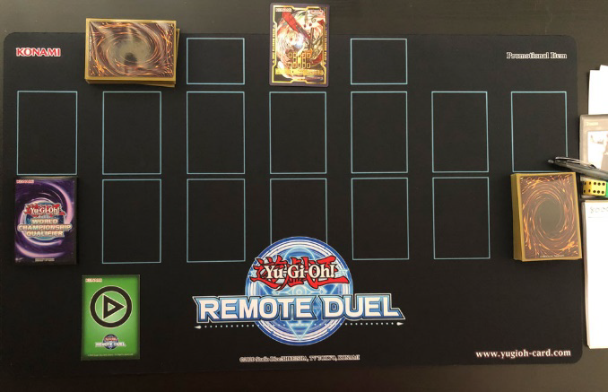
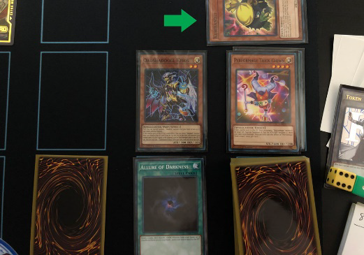
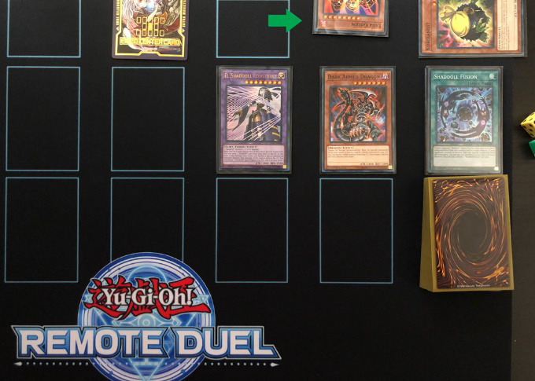
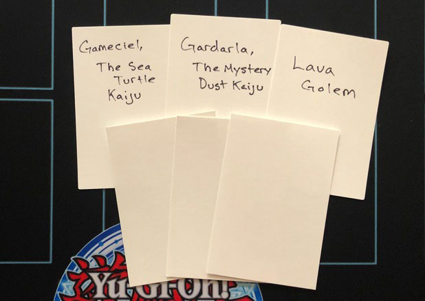

# Procedimento

- Martedì 18 febbraio su discord, inizio alle ore **21:10**
- Match al meglio dei 3
- Durata match **50 minuti** ([stabilito dalle regole ufficiali](https://img.yugioh-card.com/en/downloads/remoteduel/EN_Remote_Duel_Best_Practice_Guide_V_1_2.pdf))
- **Niente proxy**
- Tempo per siddare: 3 minuti
- Lista come screenshot da neuron
- Decklist da consegnare **entro** le 21:00 precise (puoi anche consegnarmela lista), liste consegnate dalle 21:01 in poi non le conto, prendo in considerazione l'ultima
- Controllo la lista a fine duello, quindi dovete restare per 1h circa, non potete andare offline dopo la fine del duello

# Tappetino
- Tappetino **con zone delineate**
- Tappetini non ufficiali vanno bene, voglio solo che le zone siano disegnate

# Telecamera e zone
- Le seguenti zone devono essere visibili:
    - All Monster Zones (including Extra Monster Zones)
    - All Spell/Trap Zones (including Field Spell Zone)
    - Your Deck
    - Your Graveyard
    - Your Extra Deck
    - Your Side Deck (placed to the side of an Extra Monster Zone is fine)
    - Your Banished cards
    - Your hands (not revealing the cards in your hand)

Le cate bandite vanno qua:

# Come duellare

- Annunciare ogni azione
- Essere sicuro che l'avversario ha capito ogni azione ed aspettare la conferma ad ogni azione
- No slow play, no fast play
- **Hand shuffling NO**
- In caso di lag, aspettare che si sistemi e **comunicare che si ha lag a voce o con un messaggio**. Il tempo di attesa non verrà aggiunto in un'eventuale extension
- **Le mani (quelle attaccate alle braccia non le carta) sempre visibili. Se non vuoi sempre tenerla visibili alla telecamere, posizionare le carte in mano coperte da qualche parte sul terreno prima di togliere le mani dalla telecamera. Se non si rispetta questo punto applicherò delle penalità.**

# Mischiare il mazzo
- Per semplicità facciamo che ogni volta che vuoi pescare, se prima hai searchato nel mazzo, allora devi mischiare il mazzo e poi lo tagli. Per tagliare chiedi all'avversario un numero qualsiasi, l'avversario risponde e sposti dalla cima del mazzo al fondo il numero di carte dichiarato ([stabilito dalle regole ufficiali](https://img.yugioh-card.com/en/downloads/remoteduel/EN_Remote_Duel_Best_Practice_Guide_V_1_2.pdf))

# Cambiare il controllo di una carta

- Se una carta cambia il controllo all'avversario, giralo e mettilo a faccia in già e spostalo in modo che sia visibile a metà sulla parte sopra del tuo terrono:

- Se prendi il controllo di una carta dell'avversario, prendi una sleeve vuota e mettici dentro un fogliettino con il nome della carta presa in controllo (oppure direttamente usa un fogliettino rettangolare)

# Banlist
Non penso le userete mai queste carte, ma oltre alla banlist normale le seguenti sono bandite:

# Spettatori
- Chi sta dentro il server a guarderà è meglio se mutate i microfoni
- Se vedete delle cose strane, illegal play o altro scrivetemi in privato su whatsapp o discord
- Ovviamente evitate di aiutare/suggerire chi duella

# Judge
- Mi terrò muto ma guarderò la partita per intero
- Potete interpellarmi quando volete, non vi penalizzo se mi chiedete dubbi su degli effetti
- Se mi volete far vedere la mano o carte coperte, potete:
    - Fare una foto e mandarmelo in privato su discord o whatsapp
    - Scrivermi la domanda su discord o whatsapp
    - Chiedermelo a voce, però vi dovete prima mutare e mandarmi l'audio su whatsapp
- Ogni volta che intervengo stoppo il timer. Si applicano le regole normali delle extension, se la durata **totale** delle volte in cui intervengo supera 1 minuto allora aggiungo l'extension. Leggete [qua (regole ufficiali)](https://laaners.github.io/yugioh_comprehensive_rulebook/policy/#r-time-extensions) per sapere più in dettaglio

# Policy e penalità
- **Applicherò le penalità "standard" secondo le regole ufficiali. In sintesi due penalità sulla stessa cosa risulta in un game loss (esempio due PE-Minor sulla stessa cosa, non tenete le carte in mano coperte visibili in telecamera, vi riprendo una volta è warning, vi riprendo una seconda volta è game loss)**
- Le penalità sono le stesse del gioco fisico, in dettaglio [qua](https://laaners.github.io/yugioh_comprehensive_rulebook/penalty/)
- Policy e penalità aggiuntive:

<table align="center">
    <tr>
        <td>
            <b>Caduta di connessione</b>
        </td>
        <td>
            PE-Major (Game Loss)
        </td>
    </tr>
    <tr>
        <td>
            <b>Frozen video</b>
        </td>
        <td>
            PE-Major (Game Loss). <b>Diverso da lag dove dura per poco ed è risolvibile aspettando un po'</b>
        </td>
    </tr>
    <tr>
        <td>
            <b>Terreno poco visibile, zone non tutte visibili, luce fa riflesso</b>
        </td>
        <td>
            PE-Minor (Warning). Se ci impiegate troppo per sistemare la luce e/o la telecamera allora penalità sul tempo verranno aggiunte (slow play)
        </td>
    </tr>
    <tr>
        <td>
            <b>Non tenere la mani visibili davanti alla telecamera</b>
        </td>
        <td>
            PE-Minor (Warning)
        </td>
    </tr>
    <tr>
        <td>
            <b>Aiuto da casa</b>
        </td>
        <td>
            Dipende dalla gravità dell'infrazione, UC-Minor (Warning), UC-Major (Game Loss), UC-Severe (Disqualification)
        </td>
    </tr>
</table>

# Riferimenti:

- [Remote Duel Best Practices - Version 1.2](https://img.yugioh-card.com/en/downloads/remoteduel/EN_Remote_Duel_Best_Practice_Guide_V_1_2.pdf)
- [Policies](https://laaners.github.io/yugioh_comprehensive_rulebook/policy/#r-time-extensions)
- [Penalties](https://laaners.github.io/yugioh_comprehensive_rulebook/penalty/)